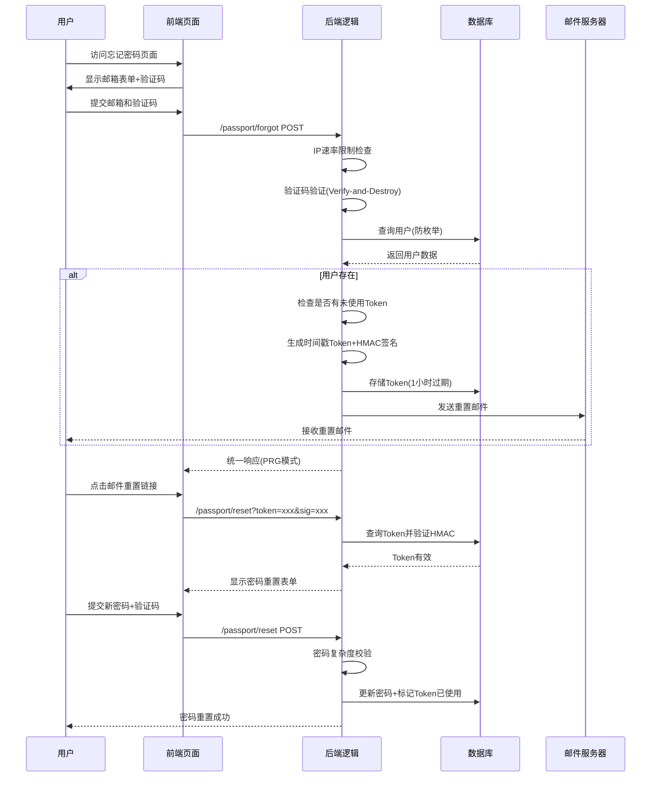
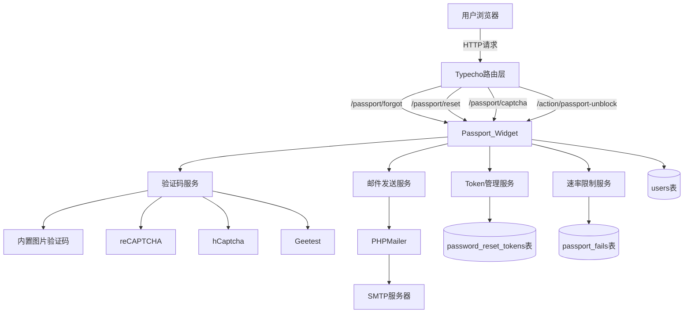
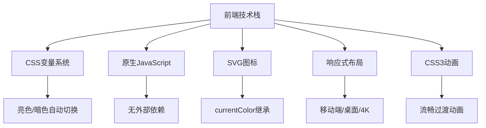
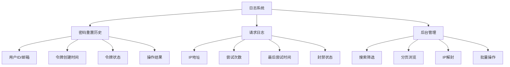

# Passport 密码找回插件 for Typecho

Passport 是为 Typecho 博客系统设计的专业密码找回与重置插件，集成多种人机验证机制、防暴力破解和 IP 速率限制功能。支持 MySQL、SQLite 和 PostgreSQL 数据库，提供完整的密码重置历史审计和请求日志管理。本项目遵循 GPLv2 协议，完全免费开源。

[](https://github.com/little-gt/Passport)
[](https://www.php.net/)
[](https://opensource.org/licenses/GPL-2.0)

## 📷 预览图

### 后台管理界面


### 密码找回页面


## 📦 项目简介

**Passport** 是为 Typecho 博客系统开发的专业密码找回插件，提供安全可靠的密码重置功能。支持 MySQL、SQLite 和 PostgreSQL 数据库，集成多种人机验证机制和完善的防暴力破解体系，提供完整的审计日志和管理员后台管理功能。

### 🚀 核心特性

| 特性 | 说明 |
|:---|:---|
| 🔐 **安全可靠** | HMAC 签名验证，Token 1小时过期，密码复杂度强制校验 |
| 🎯 **多种验证码** | 内置图片验证码、Google reCAPTCHA v2、hCaptcha、Geetest v4 |
| 🛡️ **防暴力破解** | IP 速率限制（20次尝试触发5分钟封禁），支持 CDN 环境 |
| 📊 **审计日志** | 完整的密码重置历史和请求日志记录，支持搜索和分页 |
| ✉️ **邮件模板** | 可自定义邮件模板，支持变量替换，暗黑风格默认模板 |
| 🎨 **主题适配** | 完美适配 BooAdmin 主题，支持亮色/暗色模式 |
| 📱 **响应式设计** | 移动端、桌面端、4K 屏幕完美适配 |
| 🔔 **独立通知** | Session 通知系统 + PRG 模式，防表单重复提交 |
| 🌐 **多数据库** | 原生支持 MySQL、SQLite、PostgreSQL |
| 🔧 **管理功能** | 后台 IP 解封、批量操作、日志筛选、Token 清理策略 |

## 📖 快速开始

### 安装方法

1. **下载插件**：从 GitHub 下载最新版本
2. **上传文件**：将插件目录 `passport` 解压到 Typecho 插件目录 `usr/plugins/`
3. **激活插件**：在 Typecho 后台插件管理中激活 Passport
4. **配置插件**：填写 SMTP 信息和其他配置项
5. **添加链接**：在 Typecho 后台 login.php 添加如下代码
```php
// 找到这里
<?php if($options->allowRegister): ?>
&bull;
<a href="<?php $options->registerUrl(); ?>"><?php _e('用户注册'); ?></a>
<?php endif; ?>

// 在它下面插入以下代码
<?php
   $activates = array_keys(Typecho_Plugin::export()['activated']);
   if (in_array('Passport', $activates)) {
       echo '<a href="' . Typecho_Common::url('passport/forgot', $options->index) . '">' . '忘记密码' . '</a>';
   }
?>
```

### 基本配置

| 配置项 | 说明 | 默认值 |
|-------|------|-------|
| SMTP 服务器 | 邮件发送服务器地址 | smtp.example.com |
| SMTP 端口 | 邮件发送服务器端口 | 465 |
| SMTP 帐号 | 邮件发送账号 | noreply@example.com |
| SMTP 密码 | 邮件发送密码（推荐使用客户端授权码） | - |
| 加密类型 | SMTP 加密方式 | SSL |
| 验证码类型 | 人机验证方式 | 内置图片验证码 |
| reCAPTCHA Site Key | Google reCAPTCHA v2 站点密钥 | - |
| reCAPTCHA Secret Key | Google reCAPTCHA v2 密钥 | - |
| hCaptcha Site Key | hCaptcha 站点密钥 | - |
| hCaptcha Secret Key | hCaptcha 密钥 | - |
| Geetest CAPTCHA ID | 极验验证 v4 ID | - |
| Geetest CAPTCHA KEY | 极验验证 v4 KEY | - |
| HMAC 签名密钥 | 用于签名验证的密钥 | 自动生成（32字节随机） |
| 启用请求速率限制 | 防止暴力破解和邮件滥用 | 启用 |
| IP 获取策略 | 支持默认(REMOTE_ADDR)、代理头(X-Forwarded-For/Client-IP)、自定义 Header | 默认 (REMOTE_ADDR) |
| 自定义 IP 请求头 | CDN 用户可配置（如 HTTP_CF_CONNECTING_IP），仅在选择"自定义请求头"时生效 | HTTP_CF_CONNECTING_IP |
| 请求日志每页显示数 | 设置请求日志每页显示的记录数量 | 25 |
| 请求日志保留天数 | 自动清理超过指定天数的请求日志，0 表示不自动清理 | 0 |
| 密码重置历史每页显示数 | 设置密码重置历史每页显示的记录数量 | 25 |
| Token 保留天数 | 已使用 Token 的保留天数，0 表示永久保留 | 30 天 |
| 禁用时删除数据 | 禁用插件时是否删除所有数据 | 否 |

## 🛠 技术架构

### 系统流程图



### 组件架构



### 目录结构

```
Passport/
├── Plugin.php           # 插件主文件，负责路由注册、配置面板和数据库管理
├── Widget.php           # 核心逻辑，处理密码重置流程、验证码、速率限制
├── Template/            # 前端模板
│   ├── forgot.php       # 忘记密码页面
│   ├── reset.php        # 重置密码页面
│   └── partial/         # 公共模板
│       ├── common.php   # Typecho Widget 初始化和辅助函数
│       ├── header.php   # HTML 头部（字体、视口、安全元标签）
│       └── resource.php # 静态资源（CSS 变量系统、JS 通知系统）
└── PHPMailer/           # 邮件发送库（v7.1.1）
```

### 核心技术实现

#### 1. 通知系统架构

Passport v1.0.2 采用独立的 Session 通知系统，完全脱离 Typecho 后台依赖：

**后端实现** (`Widget.php`)：
```php
// 存储通知到 Session
protected function pushNotice($message, $type = 'success', $countdown = null) {
    $_SESSION['passport_notice'] = [
        'message' => $message,
        'type' => $type,
        'countdown' => $countdown
    ];
}

// POST-Redirect-GET 模式防止表单重复提交
$this->pushNotice('操作成功', 'success');
$this->response->redirect($redirectUrl);
```

**前端渲染** (`resource.php`)：
- 使用 JSON 编码安全传递数据（`JSON_HEX_TAG | JSON_HEX_AMP | JSON_HEX_APOS | JSON_HEX_QUOT | JSON_UNESCAPED_UNICODE`）
- 采用矩形化设计：卡片式布局 + 左边框强调 + 语义背景色
- 从右往左滑入动画（`translateX(400px) → translateX(0)`）
- 智能倒计时：倒计时期间不自动关闭，结束后延迟 1 秒自动关闭
- 支持五种消息类型：success（成功）、error（错误）、warning（警告）、notice（注意）、info（提示）

**CSS 特性**：
```css
.passport-toast.success {
    border-left-color: #16a34a;  /* 左边框强调 */
    background-color: #def7ec;   /* 语义背景色 */
    color: #16a34a;              /* 语义文字色 */
    border-radius: 0;             /* 矩形化设计 */
}

@keyframes passportSlideIn {
    from { opacity: 0; transform: translateX(400px); }
    to { opacity: 1; transform: translateX(0); }
}
```

#### 2. 验证码加载机制

**智能加载指示器**：

**HTML 结构**：
```html
<div class="passport-captcha-wrapper">
    <!-- 圆形加载指示器 -->
    <div class="passport-captcha-loader active"></div>
    <!-- 验证码图片（初始隐藏） -->
    
</div>
```

**加载流程**：
1. 页面首次加载：显示空白占位 + 旋转加载器
2. DOMContentLoaded 触发：自动调用 `refreshCaptcha()`
3. 图片开始加载：加载器保持显示，图片透明度为 0
4. 图片加载完成：移除 `.loading` 类，图片淡入显示，隐藏加载器
5. 点击刷新：重复步骤 2-4

**JavaScript 实现**：
```javascript
function refreshCaptcha(imgElement) {
    const wrapper = imgElement.parentElement;
    const loader = wrapper.querySelector('.passport-captcha-loader');
    
    // 显示加载器，隐藏图片
    imgElement.classList.add('refreshing', 'loading');
    loader.classList.add('active');
    
    // 动态设置图片源（支持首次加载）
    const baseUrl = imgElement.src || '/passport/captcha';
    imgElement.src = baseUrl + '?' + Math.random();
    
    // 加载完成：隐藏加载器，显示图片
    imgElement.onload = () => {
        imgElement.classList.remove('refreshing', 'loading');
        loader.classList.remove('active');
    };
}
```

**CSS 动画**：
```css
/* 圆形加载器 */
.passport-captcha-loader {
    width: 24px;
    height: 24px;
    border: 3px solid var(--passport-border);
    border-top-color: var(--passport-primary);
    border-radius: 50%;
    animation: passkeyRotate 0.8s linear infinite;
}

/* 图片加载状态 */
.passport-captcha-img.loading {
    opacity: 0;  /* 加载时透明 */
    pointer-events: none;  /* 禁用点击 */
}
```

#### 3. 前端技术栈



Passport 前端采用现代技术栈：CSS 变量系统实现亮色/暗色自动切换（跟随系统偏好），原生 JavaScript 确保轻量高效，SVG 图标继承主题色，响应式布局适配多端（移动端/平板端/桌面端/4K屏幕），CSS3 动画提供流畅体验，矩形化设计规范（border-radius: 0）对齐 BooAdmin 主题视觉风格。

## 🔌 API 接口

### 1. 验证码接口

#### 请求信息
- **URL**: `/passport/captcha`
- **方法**: GET
- **参数**: 无
- **Headers**: 
  - `Cookie`: 必须携带 Session Cookie

#### 响应
- **类型**: `image/png`
- **大小**: 约 2-5 KB
- **尺寸**: 120x40 px
- **有效期**: Session 生命周期

#### 技术细节
- 使用 PHP GD 库动态生成
- 随机 4 位字符（去除易混淆字符）
- 包含干扰线和噪点，防止 OCR
- 验证码存储在 `$_SESSION['passport_captcha_code']`
- 验证后立即销毁（Verify-and-Destroy）

#### 示例请求
```bash
curl -X GET 'https://example.com/passport/captcha' \
  -H 'Cookie: PHPSESSID=abc123...' \
  --output captcha.png
```

#### 加载优化（v1.0.2）
- 首次访问自动加载（DOMContentLoaded 触发）
- 加载过程显示圆形旋转指示器
- 点击图片刷新，支持防重复点击
- 刷新时不旋转图片，仅显示加载指示器

### 2. 忘记密码接口

#### 请求信息
- **URL**: `/passport/forgot`
- **方法**: GET（显示表单） / POST（提交表单）
- **Content-Type**: `application/x-www-form-urlencoded`

#### POST 参数
| 字段名 | 类型 | 必填 | 验证规则 | 描述 |
|-------|------|------|----------|------|
| mail | string | 是 | Email 格式 | 用户注册邮箷 |
| captcha | string | 是 | 4-6 位字符 | 验证码（不区分大小写） |
| do | string | 是 | 固定值 `mail` | 操作类型标识 |

#### 响应类型
**成功情况**：
- **HTTP 状态**: 302 Found
- **Location**: `/passport/forgot`（重定向回表单页面）
- **Session**: 存储成功通知数据
- **通知消息**: “密码重置邮件已发送，请查收邮箱。”

**失败情况**：
- **HTTP 状态**: 302 Found
- **Session**: 存储错误通知数据
- **通知类型**: `error`
- **常见错误**：
  - “邮箱地址不存在”
  - “验证码错误”
  - “请求过于频繁，请 X 分钟后再试”（包含倒计时）

#### 技术流程
```
1. 验证请求频率（IP 速率限制，20次触发5分钟封禁）
2. 验证验证码（Session 匹配，验证后立即销毁，存储键：passport_captcha_code）
3. 验证邮箱格式（filter_var）
4. 查询用户是否存在（防范用户枚举）
5. 检查用户是否有未过期的未使用 Token
6. 生成时间戳基 Token（SHA256 + UID + 时间戳 + 随机数）或复用现有 Token
7. 生成 HMAC 签名（包含 token、uid、createdAt）
8. 存储 Token 到数据库（1小时过期）
9. 发送重置邮件（PHPMailer，支持自定义模板）
10. 存储通知到 Session
11. 重定向回表单页面（PRG 模式）
```

#### 示例请求
```bash
curl -X POST 'https://example.com/passport/forgot' \
  -H 'Content-Type: application/x-www-form-urlencoded' \
  -H 'Cookie: PHPSESSID=abc123...' \
  -d 'mail=user@example.com' \
  -d 'captcha=A3B9' \
  -d 'do=mail'
```

#### 安全机制
- 验证码验证后立即销毁（Verify-and-Destroy）
- IP 速率限制（20次尝试触发5分钟封禁，10分钟无操作重置计数）
- 邮箱枚举防护（不显示具体错误）
- Token 一次性使用
- HMAC 签名防篡改

### 3. 重置密码接口

#### 请求信息
- **URL**: `/passport/reset`
- **方法**: GET（验证链接并显示表单） / POST（提交新密码）
- **Content-Type**: `application/x-www-form-urlencoded`

#### GET 参数（邮件链接）
| 字段名 | 类型 | 必填 | 描述 |
|-------|------|------|------|
| token | string | 是 | 64 位重置令牌（SHA256） |
| signature | string | 是 | 64 位 HMAC 签名（SHA256） |

#### POST 参数
| 字段名 | 类型 | 必填 | 验证规则 | 描述 |
|-------|------|------|----------|------|
| token | string | 是 | 64 位十六进制 | 重置令牌 |
| signature | string | 是 | 64 位十六进制 | HMAC 签名 |
| password | string | 是 | 8位以上，包含大小写字母、数字、特殊字符 | 新密码 |
| confirm | string | 是 | 与 password 一致 | 确认密码 |
| captcha | string | 是 | 4-6 位字符 | 验证码 |
| do | string | 是 | 固定值 `password` | 操作类型标识 |

#### 响应类型
**成功情况**：
- **HTTP 状态**: 302 Found
- **Location**: 登录页面（Typecho 默认）
- **通知消息**: “密码重置成功，请使用新密码登录。”

**失败情况**：
- **HTTP 状态**: 302 Found
- **Location**: `/passport/reset?token=...&signature=...`
- **通知类型**: `error`
- **常见错误**：
  - “无效的重置链接”（Token 不存在）
  - “链接已失效”（Token 已过期或已使用）
  - “签名验证失败”（HMAC 不匹配）
  - “两次密码输入不一致”
  - “验证码错误”

#### 技术流程
```
GET 请求：
1. 验证 Token 和 Signature 参数存在
2. 验证 HMAC 签名（hash_equals 防止时序攻击）
3. 查询 Token 是否存在且未使用
4. 检查 Token 是否过期（1小时）
5. 显示密码重置表单

POST 请求：
1. 验证请求频率（IP 速率限制）
2. 重复 GET 请求的验证步骤
3. 验证表单数据（密码一致性）
4. 验证新密码复杂度（8位以上，包含大小写字母、数字、特殊字符）
5. 验证验证码（验证后立即销毁）
6. 更新数据库中的用户密码（PasswordHash 哈希）
7. 标记 Token 为已使用（保留记录供审计）
8. 存储成功通知
9. 重定向到登录页面
```

#### 示例请求
**GET 请求（邮件链接）**：
```
https://example.com/passport/reset?
  token=a1b2c3d4e5f6...&
  signature=1a2b3c4d5e6f...
```

**POST 请求**：
```bash
curl -X POST 'https://example.com/passport/reset' \
  -H 'Content-Type: application/x-www-form-urlencoded' \
  -H 'Cookie: PHPSESSID=abc123...' \
  -d 'token=a1b2c3d4e5f6...' \
  -d 'signature=1a2b3c4d5e6f...' \
  -d 'password=NewPass123' \
  -d 'confirm=NewPass123' \
  -d 'captcha=X7Y9' \
  -d 'do=password'
```

#### 安全机制
- HMAC 签名验证（防篡改）
- Token 一次性使用（防重放）
- Token 1 小时过期
- 验证码二次验证
- 密码复杂度校验（8位以上，包含大小写字母、数字、特殊字符）
- 两次密码一致性检查

### 4. IP 解封接口

#### 请求信息
- **URL**: `/action/passport-unblock`
- **方法**: POST
- **参数**:
  | 字段名 | 类型 | 必填 | 描述 |
  |-------|------|------|------|
  | action | string | 是 | 操作类型（`passport_unblock_ip` 或 `passport_batch_unblock`） |
  | ip | string | 条件 | 要解封的单个 IP 地址（`passport_unblock_ip`） |
  | ips | string | 条件 | 要解封的多个 IP 地址，逗号分隔（`passport_batch_unblock`） |
  | _ | string | 是 | CSRF 令牌 |

#### 响应
- **类型**: JSON
- **描述**: 返回操作结果

#### 响应示例（单个解封）
```json
{
  "success": true,
  "message": "IP [192.168.1.1] 已解封。"
}
```

#### 响应示例（批量解封）
```json
{
  "success": true,
  "message": "已成功解封 3 个 IP。"
}
```

## 🎨 主题适配

### BooAdmin 主题适配

Passport 插件完美适配 [BooAdmin](https://github.com/little-gt/BooAdmin) 主题，提供一致的视觉体验。

### 自定义主题适配

如果您使用的是自定义主题，可以通过以下方式确保 Passport 页面与主题风格一致：

1. **CSS 变量**：Passport 使用 CSS 变量定义颜色和样式，您可以在主题中覆盖这些变量
   ```css
   :root {
       --passport-primary: #your-color;
       --passport-success: #your-success-color;
       --passport-error: #your-error-color;
   }
   ```

2. **模板修改**：如需深度定制，可以修改 `Template/partial/resource.php` 中的样式
   - 通知系统样式从第 299 行开始
   - 验证码样式从第 202 行开始
   - CSS 变量定义从第 15 行开始

3. **通知系统**：Passport 使用 Session 通知系统，完全独立于主题
   - 前端使用 `PassportToast.show()` 方法显示通知
   - 支持五种类型：`success`（成功）、`error`（错误）、`warning`（警告）、`notice`（注意）、`info`（提示）
   - 自动处理倒计时和自动关闭逻辑

4. **响应式断点**：
   - 移动端：`@media (max-width: 480px)`
   - 平板端：默认样式（481px - 1919px）
   - 高清屏：`@media (min-width: 1920px)`
   - 4K 屏幕：`@media (min-width: 2560px)`

## 🔒 安全特性

```mermaid
flowchart LR
    subgraph L1[网络层]
        A1[IP速率限制]
        A2[CDN/代理适配]
        A3[智能封禁]
    end
    
    subgraph L2[应用层]
        B1[人机验证]
        B2[用户枚举防护]
        B3[XSS防护]
        B4[CSRF防护]
        B5[PRG模式]
    end
    
    subgraph L3[数据层]
        C1[HMAC签名]
        C2[Token管理]
        C3[密码复杂度校验]
        C4[参数化查询]
    end
    
    subgraph L4[审计层]
        D1[重置历史记录]
        D2[请求日志]
        D3[Token清理]
    end
    
    L1 --> L2 --> L3 --> L4
```



Passport 采用四层纵深防御架构：**网络层**通过 IP 速率限制和智能封禁抵御暴力破解；**应用层**通过人机验证、枚举防护和输入过滤防止攻击；**数据层**通过 HMAC 签名、Token 管理和密码校验确保数据安全；**审计层**通过完整日志记录和自动清理实现可追溯性。

**核心安全机制**：HMAC-SHA256 签名（包含 token、uid、时间戳）、Token 1 小时过期且一次性使用、Verify-and-Destroy 验证码机制、密码复杂度强制校验（8 位+大小写+数字+特殊字符）、用户枚举防护（统一响应）、参数化查询防 SQL 注入、IP 速率限制（20次触发5分钟封禁，10分钟无操作重置计数）。

## 📊 日志系统



Passport 提供完整的审计日志，包括密码重置历史（记录用户、令牌状态和操作结果）和请求日志（记录 IP、尝试次数和封禁状态），支持搜索、筛选和批量操作。

## 📝 邮件模板

Passport 支持自定义邮件模板，您可以在后台配置中修改邮件内容。

### 默认模板变量

| 变量 | 描述 |
|------|------|
| {username} | 用户名称 |
| {sitename} | 网站名称 |
| {requestTime} | 请求时间 |
| {resetLink} | 重置链接 |

## 🚩 版本历史

| 版本 | 日期 | 主要变更 |
|------|------|----------|
| 1.1.3 | 2026-07-01 | 适配 MySQL、SQLite 和 PostgreSQL 数据库；升级通知系统样式，与 BooAdmin 主题保持一致 |
| 1.1.2 | 2026-05-26 | 适配 BooAdmin 主题，提升整体体验 |
| 1.1.1 | 2026-05-26 | 更新 PHPMailer 到 7.1.1 版本 |
| 1.1.0 | 2026-05-26 | 质量文档更新 |
| 1.0.4 | 2026-05-17 | 修复解封 IP 时提示 404 的问题 |
| 1.0.3 | 2026-03-26 | 适配 BooAdmin 暗色模式 |
| 1.0.2 | 2026-03-03 | 优化通知视觉设计，改进验证码加载体验 |
| 1.0.1 | 2026-03-01 | 适配 BooAdmin 主题，优化通知系统，提升 SVG 图标质量 |
| 0.1.5 | 2025-12-01 | 增强 Token 安全性，添加密码重置历史审计功能 |
| 0.1.4 | 2025-10-15 | 新增 IP 拦截管理功能 |
| 0.1.3 | 2025-09-01 | 优化 IP 获取策略，增强验证码安全性 |
| 0.1.2-fix | 2025-08-10 | 修复安全漏洞，增强密码学安全性 |

## 🤝 贡献指南

我们欢迎社区贡献，包括：

- 代码优化和 bug 修复
- 新功能开发
- 文档完善
- 安全审计

请提交 Pull Request 或创建 Issue 来参与项目开发。

## 📄 许可证

Passport 插件采用 GNU General Public License v2.0 许可证。

- **作者**: GARFIELDTOM
- **网站**: https://garfieldtom.cool/
- **GitHub**: https://github.com/little-gt/Passport

---

**感谢使用 Passport 插件！** 如有任何问题或建议，请随时联系我们。